# Ranked Retrieval Model
## 任务
* 在 Homework 1.1 的基础上实现最基本的 Ranked Retrieval Model
    * Input: a query (like Ron Weasley birthday)
    * Output: Return the top K (e.g., K = 10) relevant tweets
* Use SMART notation: lnc.ltc
    * Document : logarithmic tf (l as first character), no idf and cosine normalization
    * Query: logarithmic tf (l in leftmost column), idf (t in second column), no normalization
* 改进 Inverted index
    * 在 Dictionary 中存储每个 term 的 DF
    * 在 posting list 中存储 term 在每个 doc 中的 TF with pairs (docID , tf)
* 选做
    * 支持所有的SMART Notations
## Deadline
2019.10.25 晚10点

---

## 已完成修改（Homeword1.1基础上）
#### posting增加tf信息
#### posting list

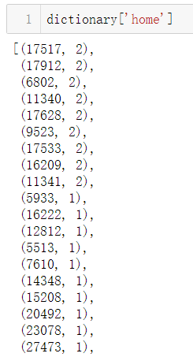
#### postings融合时使用集合运算
#### query的分词由split()改为nltk.word_tokenize()
#### 预先计算每个文档的tf向量的L2范数
```
tokens = [preprocess(x) for x in tweets] # 每个doc的分词
length = [nltk.FreqDist(x) for x in tokens] # 每个doc的词频统计信息
length = [list(x.values()) for x in length] # 每个doc的tf向量
length = [math.sqrt(sum([tf*tf for tf in x])) for x in length] # 每个doc的tf向量的L2范数
```
#### 解析查询语句时直接分词，无需考虑and、or、not
#### 定义top-K和计算w函数
#### 使用字典结构实现解析SMART notation(未实现所有)
支持：
* TF(n, l, a, b):
    * natural
    * logarithm
    * augmented
    * boolean
* DF(n, t, p):
    * no
    * idf
    * prob idf
* NORM(n, c)
    * none
    * cosine
```python
TF = {
    'n':lambda tf:tf,
    'l':lambda tf:[1+math.log(x) if x>=1 else 0 for x in tf],
    'a':lambda tf:[0.5+0.5*x/max(tf) if max(tf)>0 else 0 for x in tf],
    'b':lambda tf:[1 if x>0 else 0 for x in tf],
    
    # TODO 未实现
    'L':lambda tf:[(1+math.log(x))/(1+math.log(sum(tf)/len(tf))) for x in tf]
}

DF = {
    'n':lambda df:[1]*len(df),
    't':lambda df:[math.log(N/x) if x>=1 else 0 for x in df],
    'p':lambda df:[max(0,math.log((N-x)/x)) if x>=1 else 0 for x in df]
}

NORM = {
    'n':lambda tfdf:[1]*len(tfdf),
    'c':lambda tfdf:[1/math.sqrt(sum([w*w for w in w_list])) if sum(w_list)>0 else 0]*len(tfdf),
    
    # TODO 未实现
    'u':lambda tfdf:1,
    'b':lambda tfdf:1
}
```
## top-K实现

## 实现效果
### GUI
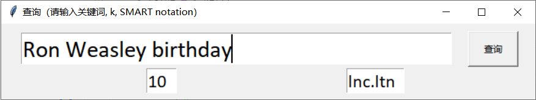
### 检索示例
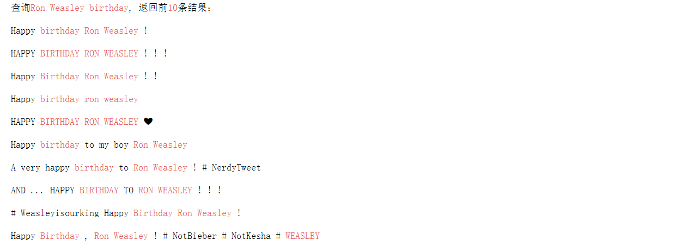

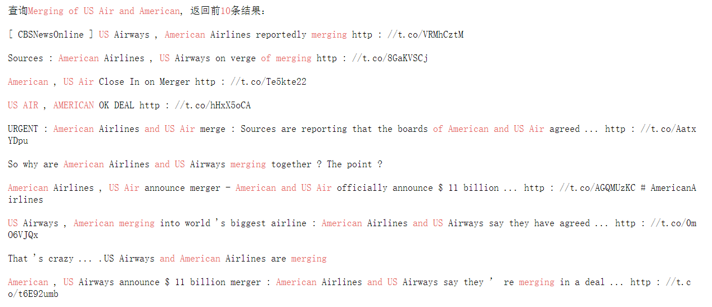

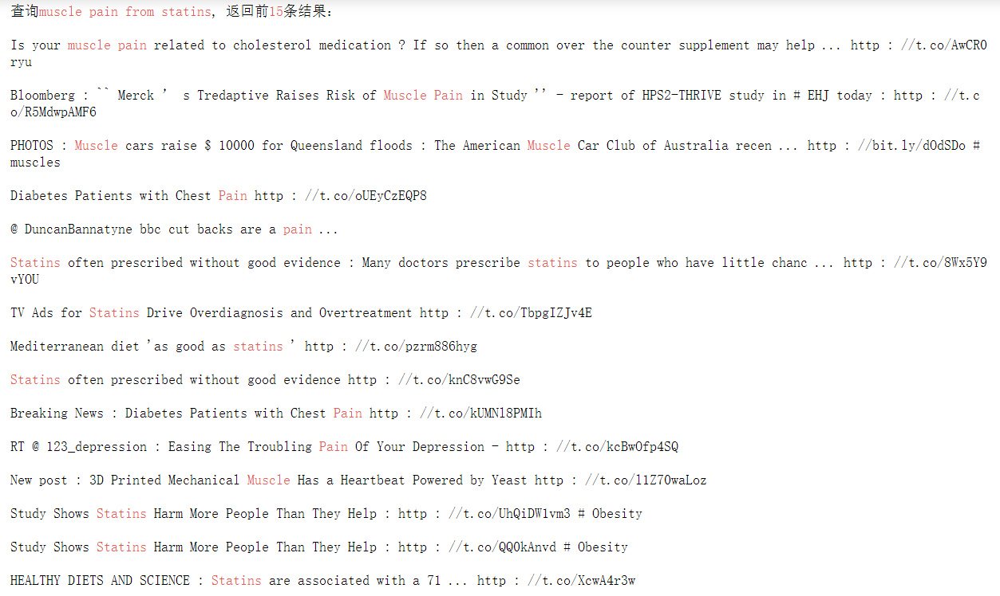
### 不同notation检索效果对比
#### 查询任务：Chinua Achebe death
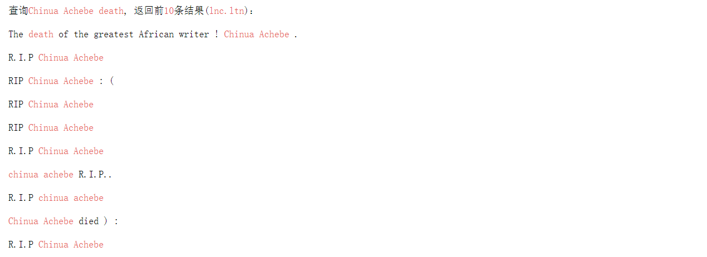

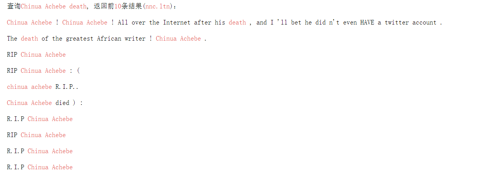

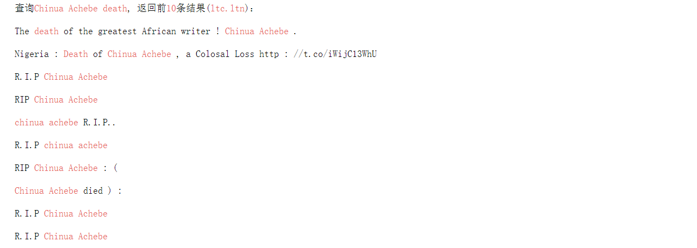

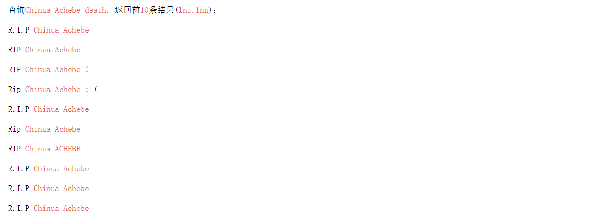

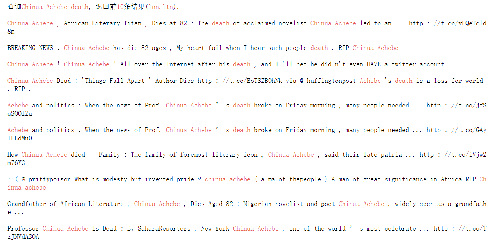

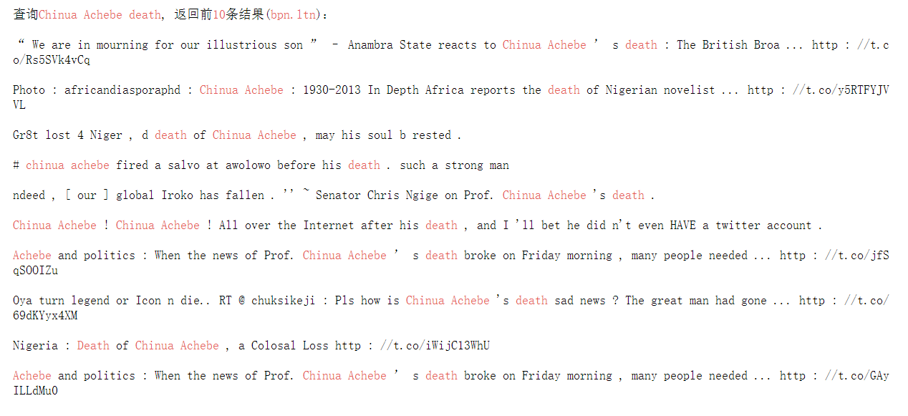

